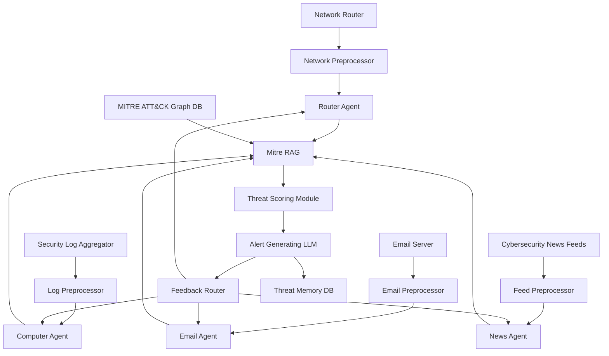

```mermaid
graph TD

%% Data Sources and Agents
A[Network Router] --> A1[Network Preprocessor] --> B[Router Agent]
D[Security Log Aggregator] --> D1[Log Preprocessor] --> E[Computer Agent]
F[Email Server] --> F1[Email Preprocessor] --> G[Email Agent]
M[Cybersecurity News Feeds] --> M1[Feed Preprocessor] --> N[News Agent]

%% Knowledge Fusion
B --> C[Mitre RAG]
E --> C
G --> C
N --> C
H[MITRE ATT&CK Graph DB] --> C

%% Reasoning and Alerting
C --> J[Threat Scoring Module] --> I[Alert Generating LLM]

%% Feedback and Memory
I --> K[Feedback Router]
K --> B
K --> E
K --> G
K --> N
I --> L[Threat Memory DB]

```