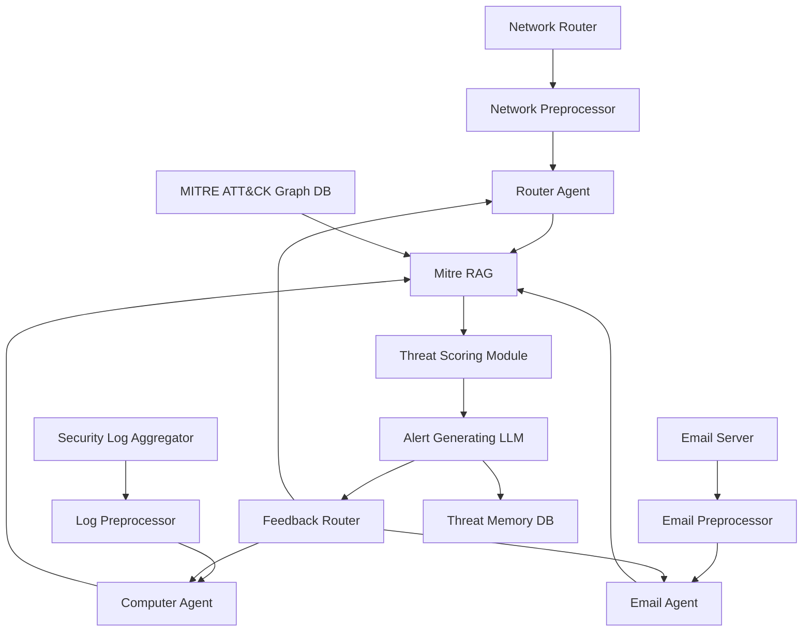

# Modular Threat Intelligence Pipeline

This architecture outlines a modular, agent-driven cybersecurity pipeline designed for adaptive threat detection, contextual alerting, and long-term pattern evolution. It integrates structured and unstructured data sources, processes them through specialized agents, and synthesizes insights via a Retrieval-Augmented Generation (RAG) module backed by MITRE ATT&CK.

---

## Components and Flow

### 1. **Data Ingestion & Agent Layer**
Each data source is paired with a preprocessing module and a specialized agent:

- **Network Router → Network Preprocessor → Router Agent**  
  Captures and normalizes network traffic patterns.

- **Security Log Aggregator → Log Preprocessor → Computer Agent**  
  Extracts behavioral and system-level anomalies.

- **Email Server → Email Preprocessor → Email Agent**  
  Detects phishing, spoofing, and suspicious payloads.

---

### 2. **Knowledge Fusion**
- **MITRE ATT&CK Graph DB**  
  Supplies structured threat intelligence.

- **Mitre RAG Module**  
  Fuses agent outputs with MITRE knowledge for contextual enrichment and retrieval.

---

### 3. **Reasoning & Alerting**
- **Threat Scoring Module**  
  Ranks threats by severity, novelty, and confidence.

- **Alert Generating LLM**  
  Produces human-readable alerts with contextual explanations.

---

### 4. **Feedback & Memory**
- **Feedback Router**  
  Distributes LLM-derived insights back to agents for adaptive learning and pattern refinement.

- **Threat Memory DB**  
  Stores historical patterns, embeddings, and alert provenance for long-term evolution, auditability, and replay.

---

## System Capabilities

- **Closed-loop learning**: Agents evolve based on feedback from alert outcomes.
- **Cross-agent coordination**: Enables correlation across network, log, and email domains.
- **Explainable alerting**: Alerts are traceable to contributing inputs and threat sources.
- **Scalable modularity**: Each agent and module can be independently tuned or replaced.
